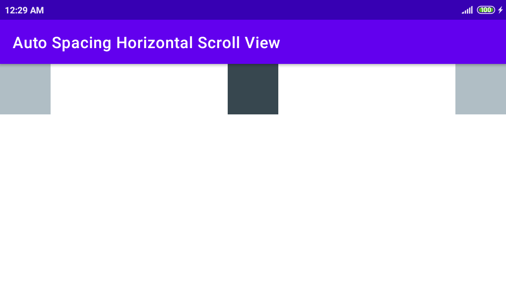
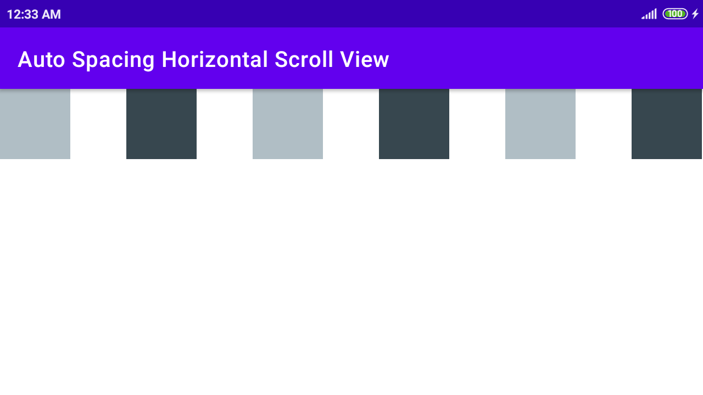
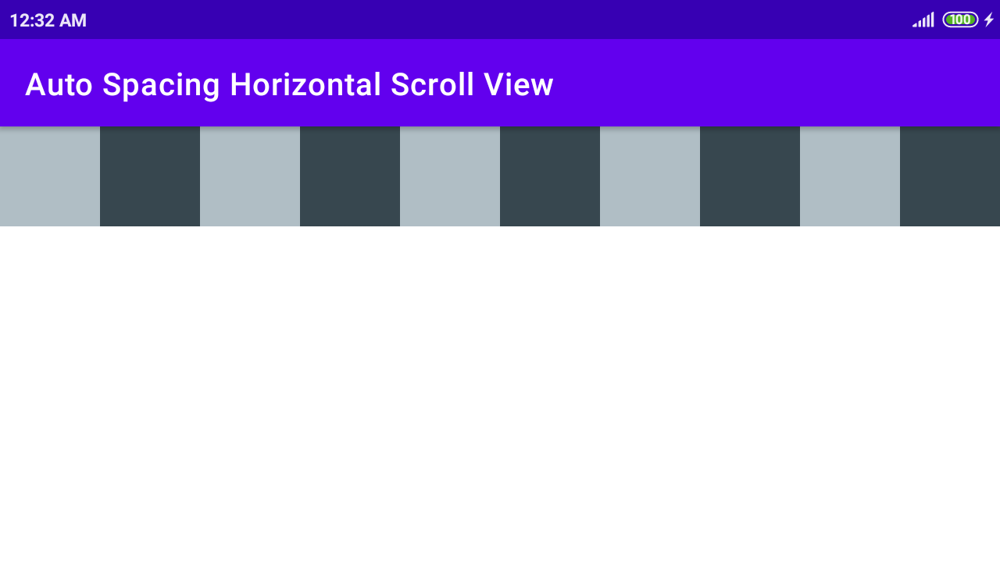

# Auto Spacing Horizontal Scroll View

Stackoverflow Question - 
https://stackoverflow.com/questions/68836328/how-to-space-items-evenly-in-a-horizontalscrollview-if-content-is-smaller-than-t

A horizontally scrollable view which has spaceBetween when the children views does not require scrolling. 
i.e. Children view occupy less space that screen width. 

## 3 children

### Portrait

  

### Landscape

  

## 6 children

### Portrait

  

### Landscape

  

## 10 children

### Portrait

  

### Landscape

  
